# ByCoders iOS Challenge

[English](#english) | [Português](#português)

## Stack

- SwiftUI
- Swift Concurrency
- Combine
- MapKit
- CoreLocation
- SwiftData
- Firebase Authentication
- Firebase Analytics
- Firebase Crashlytics
- Swift Testing
- XCUITest


## English

SwiftUI application developed for the ByCoders Senior iOS Developer technical challenge.

The app authenticates users with Firebase Authentication, displays their current location on a map, persists the authenticated user and last location locally, sends events to Firebase Analytics, and records non-fatal errors in Firebase Crashlytics.

### Core features

- Email and password authentication with Firebase Authentication.
- Home screen with MapKit and the user's current-location marker.
- Local persistence of the authenticated user and last location with SwiftData.
- Success events sent to Firebase Analytics.
- Non-fatal error reporting with Firebase Crashlytics.
- Unit tests with Swift Testing and UI/E2E tests with XCUITest.

### Additional features beyond the briefing

- Full localization in English and Brazilian Portuguese (string catalog), including the system location-permission message.
- Restores the persisted session when the app is reopened.
- Offline fallback: when GPS fails or permission is denied, the map shows the last persisted location with a banner indicating the data may be outdated and a context-aware recovery action (retry or open Settings).
- Secure logout with confirmation, removing the local session and the persisted last location (personal data does not outlive the session).
- Dedicated explanation screen when location access is denied.
- Shortcut to the app's Settings page, with automatic retry when the app returns to the foreground.
- Full dark mode support with a semantic color palette (asset-catalog light/dark variants: the blue accent shifts to teal in dark mode for better contrast over the dark map).
- Custom app icon with dark and tinted variants for the iOS appearance modes.
- Layout adapted for iPad and large screens (regular size class), with a dedicated two-column login layout.
- Recenter button displayed after the user moves the map.
- Password visibility control on the login screen.
- Explicit loading, permission-denied, and error states.
- Deterministic UI test scenarios that do not depend on Firebase, internet access, or real GPS data.
- SwiftUI previews for the main screens and map component.

### Requirements and setup

- macOS with **Xcode 26 or later** — the build settings rely on Swift 6.2 features (default `MainActor` isolation, approachable concurrency).
- The app runs on **iOS 17.0 or later** (same deployment target for the app and test targets).
- Swift Package Manager enabled.
- An iOS Simulator or physical device.

1. Clone the repository.
2. Open `ByCodersChallenge/ByCodersChallenge.xcodeproj`.
3. Wait for Swift Package Manager to resolve the Firebase dependencies.
4. Select the `ByCodersChallenge` scheme.
5. Run with `Command + R`.

Demo credentials:

```text
Email: teste@teste.com
Password: 123456
```

Command-line build:

```bash
xcodebuild build \
  -project ByCodersChallenge/ByCodersChallenge.xcodeproj \
  -scheme ByCodersChallenge \
  -destination 'generic/platform=iOS Simulator' \
  CODE_SIGNING_ALLOWED=NO
```

### Firebase configuration and security

The project uses `FirebaseAuth`, `FirebaseAnalytics`, and `FirebaseCrashlytics`.

> **Note for evaluators:** `GoogleService-Info.plist` is committed to this repository on purpose, exclusively for this take-home challenge, so the project builds and runs immediately without any manual Firebase setup. It only contains client configuration identifiers and keys and does not grant administrative access to Firebase. **This is not how a real production project would be set up** — see below.

For a production app, use separate Firebase projects for development, staging, and production; restrict enabled resources and authentication methods; never reuse real credentials or data; never commit `GoogleService-Info.plist` (add it to `.gitignore` and distribute it through a secrets manager or CI variables instead); and never commit service-account keys or administrative credentials.

### Architecture and persistence

The project follows MVVM with dependency injection:

```text
SwiftUI View
    -> ViewModel
        -> Service protocols
        -> Repository protocols
            -> Firebase / CoreLocation / SwiftData
```

`AppContainer` composes dependencies, `AppSession` owns global authentication state, ViewModels coordinate use cases, services integrate with Firebase and CoreLocation, and repositories isolate SwiftData persistence. Views and ViewModels do not depend directly on Firebase.

SwiftData stores the authenticated user's identifier, email, name, and login date, as well as the last location's latitude, longitude, and update date.

### Analytics and Crashlytics

| Event | Parameters |
|---|---|
| `login_success` | `user_id`, `provider` |
| `home_rendered` | `user_id`, `latitude`, `longitude` |

Authentication, session restoration, location loading, persistence, and logout failures are recorded as non-fatal errors with screen and action context. A user's decision to deny location permission is not treated as an error.

### Tests

Unit tests cover credential validation, authentication success and failure, persistence (including upsert and last-location fallback reads), global session updates, Analytics events, Crashlytics reporting, location states with stale-location fallback, and logout. The CoreLocation bridge is tested through an injected `LocationManaging` seam, including authorization flow, error mapping, and coalescing of concurrent location requests into a single in-flight GPS read.

UI/E2E tests cover login validation, password visibility, successful and failed login, session restoration, Home loading, denied location permission, location failure, logout, and an English-localization smoke test.

The shared scheme runs through a test plan with code coverage enabled for the app target.

Run them with `Command + U` or:

```bash
xcodebuild test \
  -project ByCodersChallenge/ByCodersChallenge.xcodeproj \
  -scheme ByCodersChallenge \
  -destination 'platform=iOS Simulator,name=iPhone 17'
```

---

## Português

Aplicativo SwiftUI desenvolvido para o desafio técnico de Desenvolvedor iOS Sênior da ByCoders.

O app autentica usuários com Firebase Authentication, exibe a localização atual em um mapa, persiste localmente o usuário autenticado e a última localização, envia eventos ao Firebase Analytics e registra erros não fatais no Firebase Crashlytics.

### Funcionalidades principais

- Autenticação com email e senha usando Firebase Authentication.
- Home com MapKit e marcador da localização atual do usuário.
- Persistência local do usuário autenticado e da última localização com SwiftData.
- Eventos de sucesso enviados ao Firebase Analytics.
- Registro de erros não fatais com Firebase Crashlytics.
- Testes unitários com Swift Testing e testes UI/E2E com XCUITest.

### Funcionalidades adicionais além do briefing

- Localização completa em inglês e português do Brasil (string catalog), incluindo a mensagem de permissão de localização do sistema.
- Restauração da sessão persistida ao reabrir o aplicativo.
- Fallback offline: quando o GPS falha ou a permissão é negada, o mapa exibe a última localização persistida com um banner indicando que o dado pode estar desatualizado e uma ação de recuperação adequada ao contexto (tentar novamente ou abrir os Ajustes).
- Logout seguro com confirmação, removendo a sessão local e a última localização persistida (dados pessoais não sobrevivem à sessão).
- Tela dedicada para explicar a necessidade da localização quando a permissão é negada.
- Atalho para os Ajustes do aplicativo, com nova tentativa automática quando o app volta ao primeiro plano.
- Suporte completo a dark mode com paleta de cores semântica (variantes light/dark no asset catalog: o acento azul muda para teal no modo escuro, com melhor contraste sobre o mapa escuro).
- Ícone do aplicativo personalizado com variantes dark e tinted para os modos de aparência do iOS.
- Layout adaptado para iPad e telas grandes (size class regular), com login em duas colunas.
- Botão para recentralizar o mapa exibido após o usuário movimentá-lo.
- Controle para exibir ou ocultar a senha na tela de login.
- Estados explícitos de carregamento, permissão negada e erro.
- Cenários determinísticos de testes de UI que não dependem do Firebase, internet ou GPS real.
- Previews SwiftUI para as telas principais e o componente de mapa.

### Requisitos e execução

- macOS com **Xcode 26 ou superior** — os build settings utilizam recursos do Swift 6.2 (isolamento `MainActor` por padrão, approachable concurrency).
- O aplicativo roda em **iOS 17.0 ou superior** (mesmo deployment target para o app e os targets de teste).
- Swift Package Manager habilitado.
- Um simulador iOS ou dispositivo físico.

1. Clone o repositório.
2. Abra `ByCodersChallenge/ByCodersChallenge.xcodeproj`.
3. Aguarde o Swift Package Manager resolver as dependências do Firebase.
4. Selecione o scheme `ByCodersChallenge`.
5. Execute com `Command + R`.

Credenciais de demonstração:

```text
Email: teste@teste.com
Senha: 123456
```

Compilação pela linha de comando:

```bash
xcodebuild build \
  -project ByCodersChallenge/ByCodersChallenge.xcodeproj \
  -scheme ByCodersChallenge \
  -destination 'generic/platform=iOS Simulator' \
  CODE_SIGNING_ALLOWED=NO
```

### Configuração e segurança do Firebase

O projeto utiliza `FirebaseAuth`, `FirebaseAnalytics` e `FirebaseCrashlytics`.

> **Nota para o avaliador:** o `GoogleService-Info.plist` foi versionado de propósito, exclusivamente para este teste/desafio, para que o projeto compile e rode imediatamente sem nenhuma configuração manual do Firebase. Ele contém apenas identificadores e chaves de configuração do cliente e não concede acesso administrativo ao Firebase. **Em um ambiente de produção isso seria feito de outra forma** — veja abaixo.

Em um aplicativo de produção, utilize projetos Firebase separados para desenvolvimento, homologação e produção; restrinja os recursos e métodos de autenticação habilitados; nunca reutilize dados ou credenciais reais; nunca versione o `GoogleService-Info.plist` (adicione-o ao `.gitignore` e distribua-o via um gerenciador de segredos ou variáveis de CI); e nunca versione service-account keys ou credenciais administrativas.

### Arquitetura e persistência

O projeto utiliza MVVM com injeção de dependências:

```text
SwiftUI View
    -> ViewModel
        -> Service protocols
        -> Repository protocols
            -> Firebase / CoreLocation / SwiftData
```

O `AppContainer` compõe as dependências, o `AppSession` mantém o estado global de autenticação, as ViewModels coordenam os casos de uso, os serviços integram Firebase e CoreLocation, e os repositórios isolam a persistência SwiftData. Views e ViewModels não dependem diretamente do Firebase.

O SwiftData armazena o identificador, email, nome e data de login do usuário autenticado, além da latitude, longitude e data de atualização da última localização.

### Analytics e Crashlytics

| Evento | Parâmetros |
|---|---|
| `login_success` | `user_id`, `provider` |
| `home_rendered` | `user_id`, `latitude`, `longitude` |

Falhas de autenticação, restauração da sessão, carregamento da localização, persistência e logout são registradas como erros não fatais com contexto de tela e ação. A decisão do usuário de negar a localização não é tratada como erro.

### Testes

Os testes unitários cobrem validação das credenciais, sucesso e falha de autenticação, persistência (incluindo upsert e leitura da última localização para o fallback), atualização da sessão global, eventos de Analytics, registros no Crashlytics, estados de localização com fallback de localização desatualizada e logout. A ponte com o CoreLocation é testada por meio de um seam injetável (`LocationManaging`), incluindo o fluxo de autorização, o mapeamento de erros e a unificação de requisições concorrentes em uma única leitura de GPS em andamento.

Os testes UI/E2E cobrem validação do login, visibilidade da senha, login com sucesso e falha, restauração da sessão, carregamento da Home, permissão de localização negada, falha de localização, logout e um smoke test da localização em inglês.

O scheme compartilhado executa por meio de um test plan com code coverage habilitado para o target do app.

Execute com `Command + U` ou:

```bash
xcodebuild test \
  -project ByCodersChallenge/ByCodersChallenge.xcodeproj \
  -scheme ByCodersChallenge \
  -destination 'platform=iOS Simulator,name=iPhone 17'
```

---

## Screenshots / Capturas de tela

### iPhone

<p align="center">
  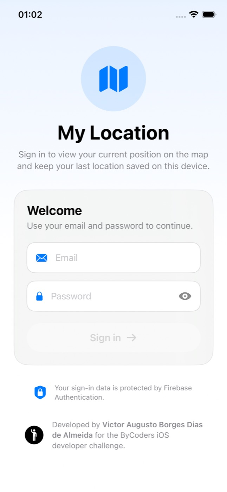
  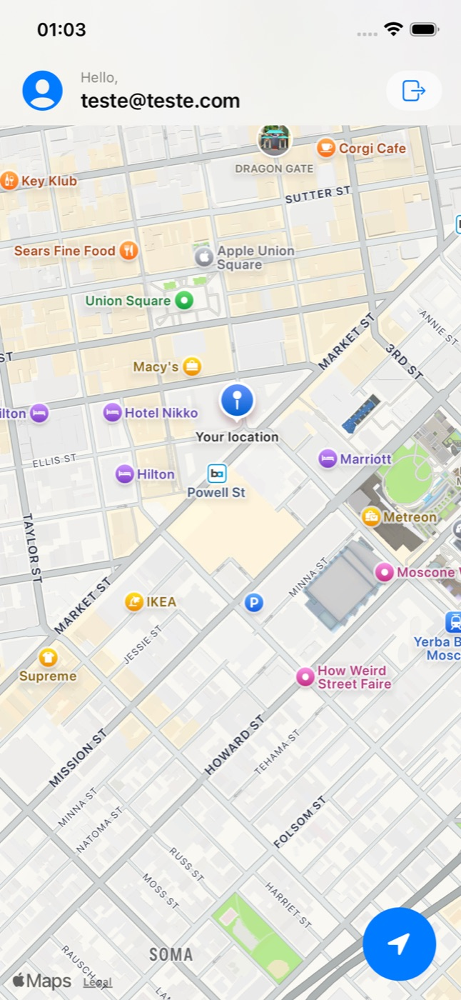
  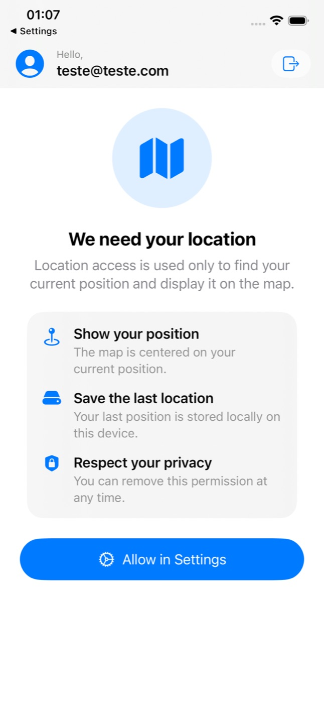
</p>

### iPhone (Dark Mode)

<p align="center">
  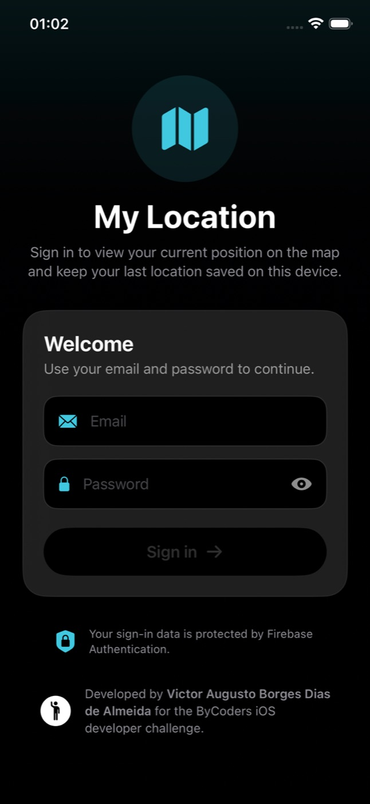
  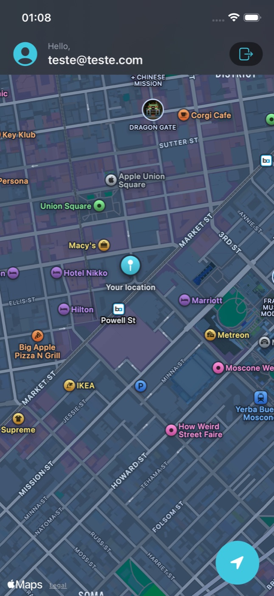
  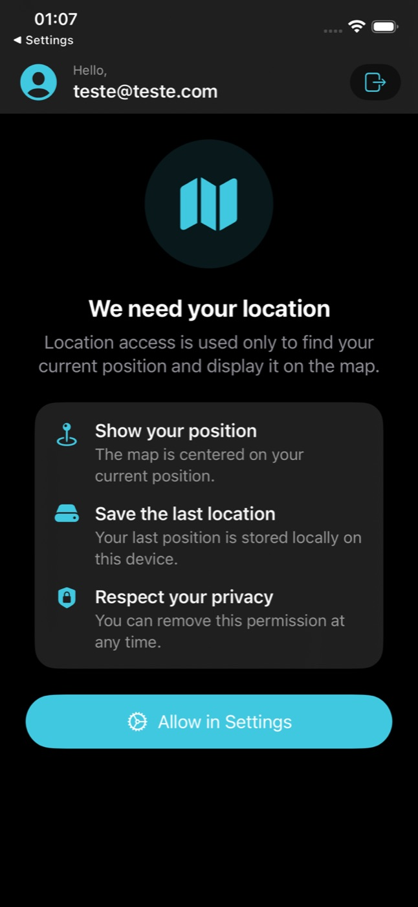
</p>

### iPad (Portrait)

<p align="center">
  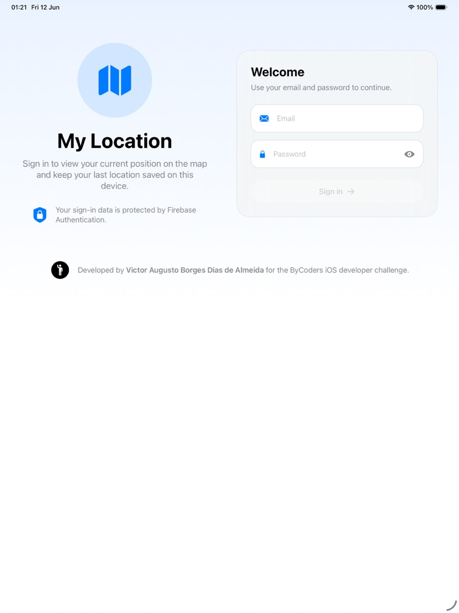
  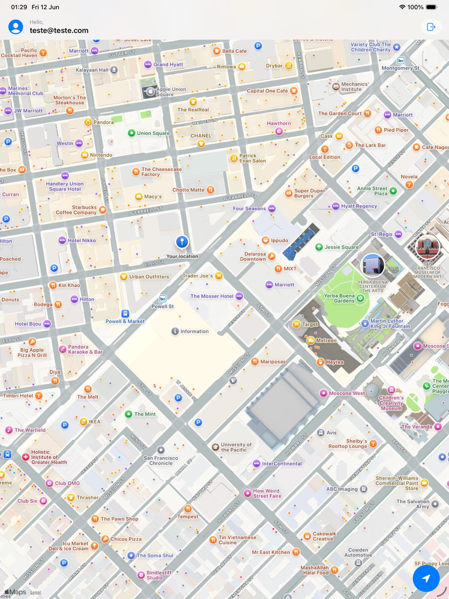
  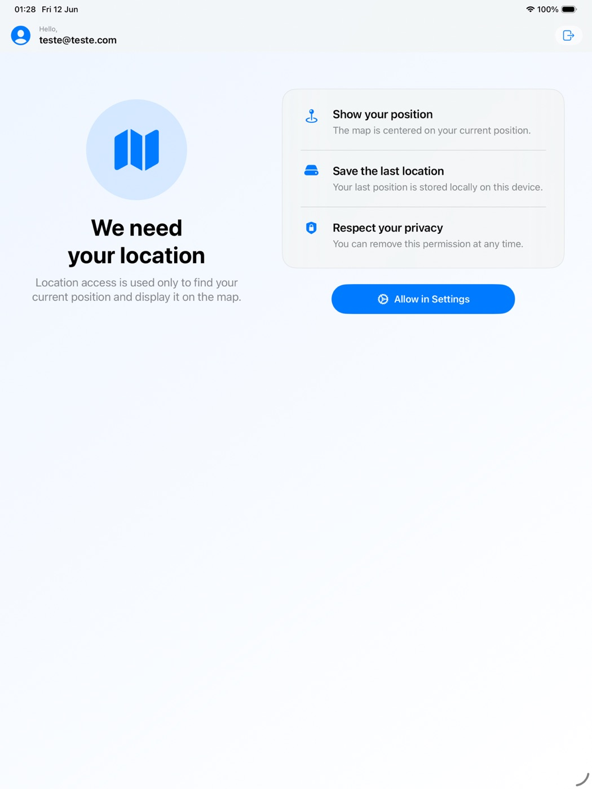
</p>

### iPad (Landscape)

<p align="center">
  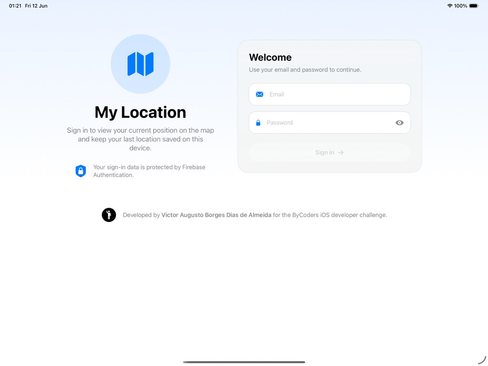
  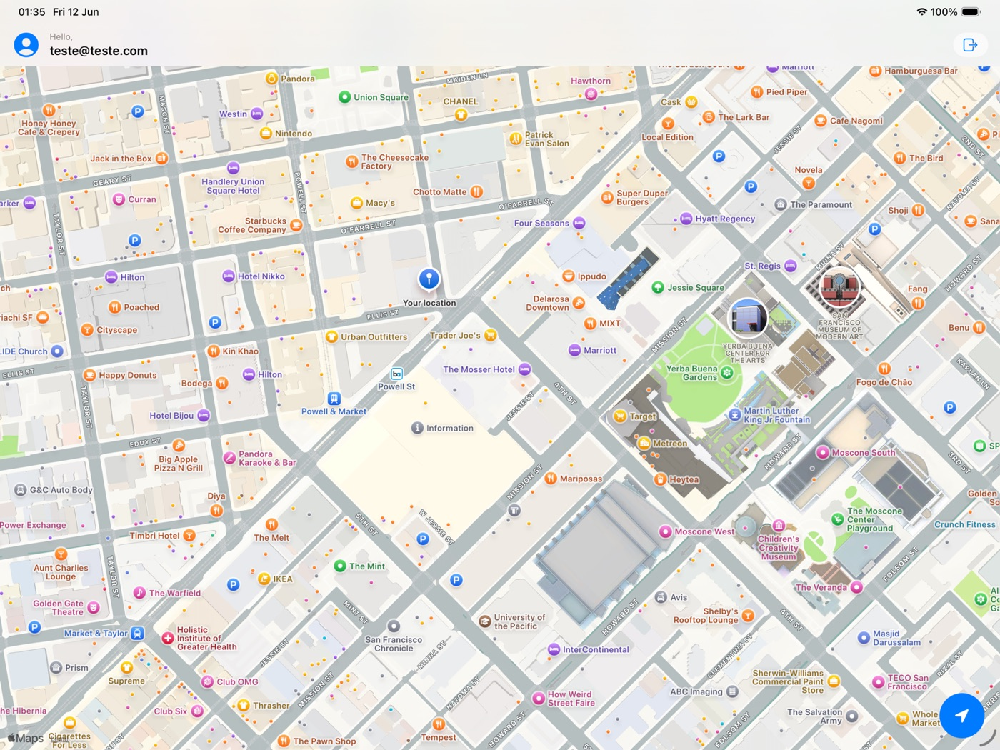
  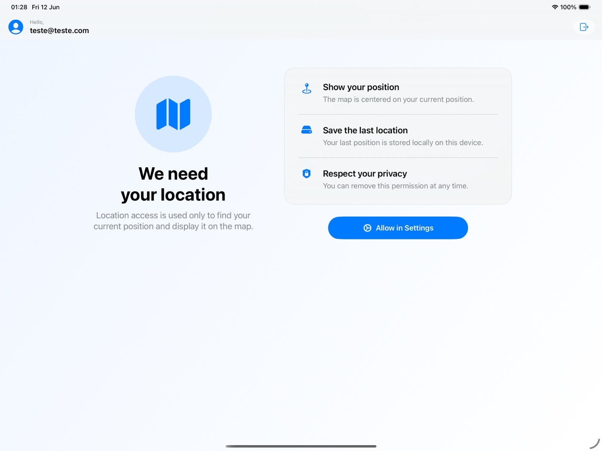
</p>
